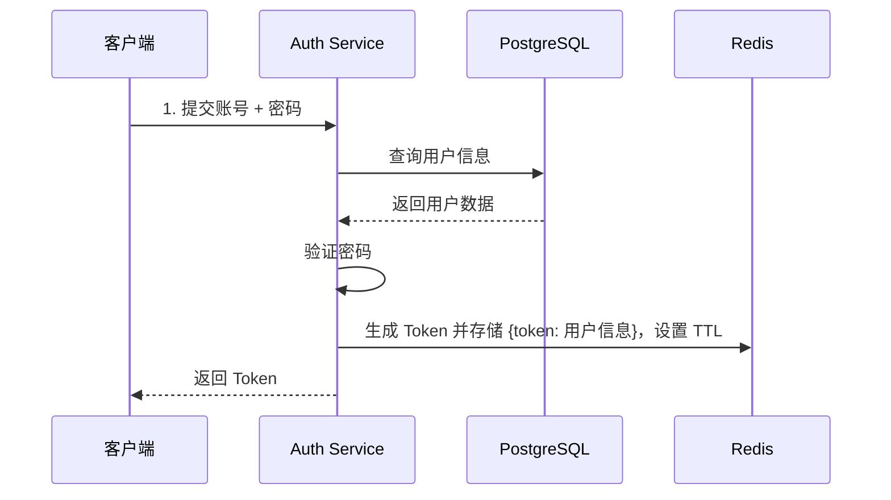
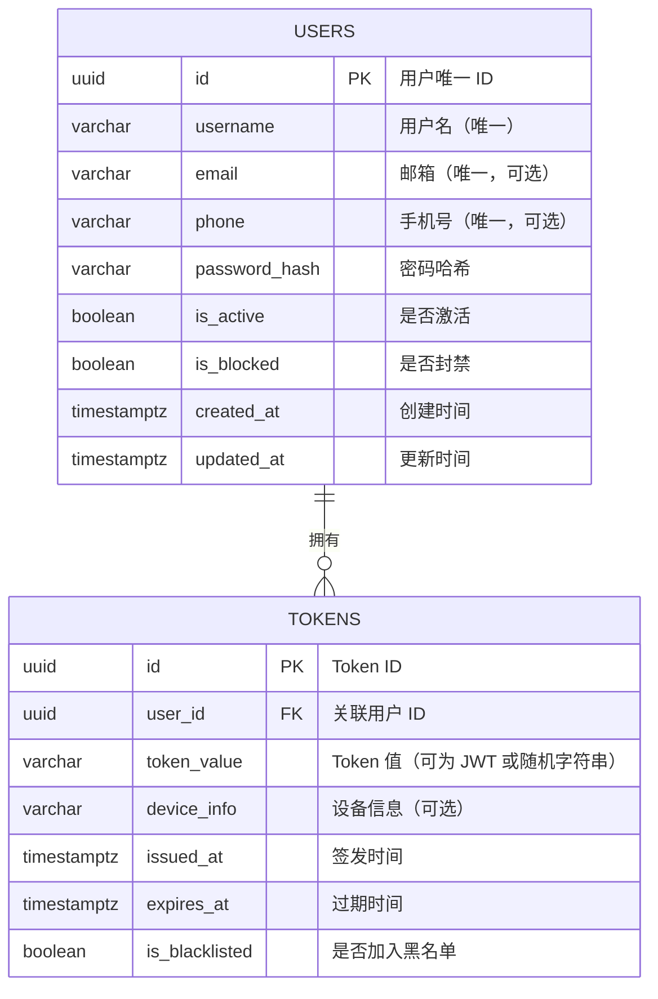

# golang-auth-service
Golang Auth Service — A unified authentication &amp; registration service built with Golang, JWT, Redis, PostgreSQL.


# Golang 统一登录注册服务（PostgreSQL + Redis）

## 1. 项目目标
- 统一用户注册、登录、登出、踢下线、黑名单管理
- 使用 **PostgreSQL** 存储用户信息
- Token 不使用纯无状态 JWT，改为 **服务端存储的 Token 会话模式**
- 支持单点登录（SSO）扩展
- 部署使用 Docker

---

## 2. 技术路线

### 架构选型
- **语言**：Golang
- **框架**：Gin / Fiber / Echo
- **数据库**：PostgreSQL（存储用户信息）
- **缓存**：Redis（验证码、Token 会话、黑名单）
- **认证方式**：Access Token 存储在 Redis（可用 JWT 或随机字符串作为 Token 值）
- **部署方式**：Docker + docker-compose

### 2.1 核心功能模块
1. **用户注册**
   - [ ] 支持用户名、邮箱、手机号注册
   - [ ] 密码加密存储（bcrypt / argon2）
   - [ ] 邮箱/手机号验证码验证（可选）
   - [ ] 唯一性校验
2. 登录模块
   - [ ] 账号密码登录（验证加密密码）
   - [ ] 第三方登录（微信、Google、GitHub）可扩展
   - [ ] 登录成功签发 JWT Access Token + Refresh Token
3. Token 管理
   - [ ] Access Token（短期有效，如 15-30 分钟）
   - [ ] Refresh Token（长期有效，如 7-30 天）
   - [ ] Redis 存储 Token 黑名单（退出登录/封禁）
   - [ ] Token 刷新接口（防止频繁输入密码）
4. 用户信息管理
   - [ ] 基本信息查询（昵称、头像、邮箱）
   - [ ] 修改密码（原密码验证 + 新密码加密）
   - [ ] 重置密码（验证码/邮件链接）
5. 安全防护
   - [ ] 频率限制（登录/注册接口加限流）
   - [ ] IP 黑名单/白名单
   - [ ] 防 SQL 注入 & XSS（使用 ORM 和严格校验）
   - [ ] HTTPS（TLS 证书）

---

## 3. Token 设计方案

### 3.1 为什么不用纯 JWT
- 纯无状态 JWT 无法在服务端主动失效（不能踢下线）
- 不能轻松实现黑名单机制
- 无法在 Token 生命周期中间修改权限（除非重新发 Token）

### 3.2 新方案
1. **登录成功**
   - 生成 Access Token（UUID / JWT）
   - 将 Token 存储到 Redis（Key: `token:{token_id}`，Value: 用户信息，TTL）
   - 支持设置 **单设备登录**（登录时清除旧 Token）
2. **用户登出 / 踢下线**
   - 从 Redis 删除 Token Key
   - 将 Token 加入黑名单（可选 TTL）
3. **接口鉴权**
   - 根据 Token 去 Redis 查询用户信息
   - 如果不存在则视为无效/已失效
4. **黑名单机制**
   - Token 被列入黑名单时拒绝访问
   - 黑名单存储在 Redis，TTL 与 Token 过期时间一致

---

## 4. 组件需求

| 组件/库                 | 用途                |
| ----------------------- | ------------------- |
| `gin` / `fiber`         | HTTP API 框架       |
| `gorm` / `sqlx`         | PostgreSQL ORM/操作 |
| `uuid`                  | Token 生成          |
| `go-redis/redis/v9`     | Redis 操作          |
| `bcrypt` / `argon2`     | 密码加密            |
| `validator.v10`         | 请求参数校验        |
| Docker + docker-compose | 容器化部署          |
| Nginx（可选）           | HTTPS 反向代理      |

---

## 5. 系统架构（Mermaid）

~~~mermaid
graph TD
    subgraph Client[前端客户端<br/>(Web / Mobile / 其他服务)]
    end

    subgraph AuthService[Auth Service<br/>(Golang + Gin/Fiber)]
    end

    subgraph DB[MySQL / PostgreSQL]
    end

    subgraph Cache[Redis 缓存]
    end

    subgraph JWT[JWT 认证模块]
    end

    Client -->|HTTP/HTTPS REST API| AuthService
    AuthService --> DB
    AuthService --> Cache
    AuthService --> JWT
    JWT -->|签发 & 验证| AuthService

~~~


## 6. 登录 & 会话管理数据流（Mermaid）

### 登录流程



### 踢下线流程

```
mermaid


复制编辑
sequenceDiagram
    participant Admin as 管理端
    participant A as Auth Service
    participant R as Redis

    Admin->>A: 请求踢下线（指定用户或 Token）
    A->>R: 删除 Redis 中的 token key
    A->>R: 将 Token 加入黑名单（TTL 与 token 过期时间一致）
    A-->>Admin: 返回成功
```

------

## 7. 部署方案（Docker 化）

docker-compose.yml 示例：

```yaml

version: '3'
services:
  auth-service:
    build: .
    ports:
      - "8080:8080"
    depends_on:
      - postgres
      - redis
    environment:
      - DB_HOST=postgres
      - DB_USER=authuser
      - DB_PASSWORD=authpass
      - DB_NAME=authdb
      - REDIS_HOST=redis

  postgres:
    image: postgres:15
    restart: always
    environment:
      POSTGRES_USER: authuser
      POSTGRES_PASSWORD: authpass
      POSTGRES_DB: authdb
    ports:
      - "5432:5432"

  redis:
    image: redis:7
    restart: always
    ports:
      - "6379:6379"
```

------

## 8. 注意事项

1. **安全**
   - Token 存储到 Redis 时，设置合理 TTL（比如 15 分钟）
   - 采用 Refresh Token 机制进行续签
   - Redis 黑名单确保踢下线可立即生效
2. **可扩展性**
   - 预留 OAuth 2.0 / SAML 接入位置
   - 多节点部署时共享 Redis 会话数据
3. **维护**
   - 提供管理后台接口（查询在线用户、强制下线）
   - 日志记录登录、登出、踢下线等关键事件


## 9. 数据库设计（Mermaid ER 图）




## 10. Redis 存储结构

| Key 模式               | Value                          | 说明                                           |
| ---------------------- | ------------------------------ | ---------------------------------------------- |
| `token:{token_id}`     | JSON（用户ID、权限、设备信息） | 存储当前有效会话，TTL 控制过期时间             |
| `blacklist:{token_id}` | true                           | 黑名单标记，TTL 与 token 相同，用于踢下线/封禁 |


## 11. 业务规则

1. **单设备登录**
    登录时先删除该用户在 Redis 中的旧 `token:{old_token_id}`，再存新的 Token。
2. **踢下线**
    后台调用 API 删除 `token:{token_id}` 并写入 `blacklist:{token_id}`。
3. **封禁用户**
   - 将用户 `is_blocked` 标记为 true
   - 删除该用户所有 Token（遍历 Redis / Token 表）
   - 新登录直接拒绝
4. **刷新 Token**
   - Access Token TTL 较短（15~30 分钟）
   - Refresh Token TTL 较长（7~30 天）
   - 刷新时重新写入 Redis 并更新 Token 表


## 12. OAuth2.0 接口

**兼容性**：OAuth2 已经是事实标准，几乎所有第三方（Google、GitHub、微信、钉钉等）都用这个协议。
**扩展性**：后期要加「第三方登录」时，无需大改 Auth 服务，只要实现已有接口逻辑。
**一致性**：内部自有用户和外部第三方用户，都走统一的授权流程，方便业务系统无感知使用。


### 12.1 OAuth2.0 常见接口（需要预留）

1. **授权接口**
   - `GET /oauth/authorize`
   - 用户访问这个接口，会被要求登录/确认授权。
   - 成功后会返回一个授权码（Authorization Code）。
2. **令牌接口**
   - `POST /oauth/token`
   - 用于交换 `Authorization Code` → `Access Token`（以及可选的 `Refresh Token`）。
   - 未来第三方（Google/GitHub）或业务服务都会通过这个接口拿 Token。
3. **用户信息接口**
   - `GET /oauth/userinfo`
   - 根据 Access Token，返回用户信息（id、name、email、角色等）。
   - 业务服务只需要调用这个接口，就能知道“当前是谁”。
4. **登出接口**
   - `POST /oauth/logout`
   - 让 Access Token 失效（加黑名单，或删除 Redis Key）。

### 12.2 现有架构中的位置

~~~mermaid
flowchart LR
    Client[前端/客户端] -->|用户名密码登录| Auth[Auth Service]
    Client -->|OAuth2 登录请求| Auth
    Auth --> Redis[(Redis)]
    Auth --> PostgreSQL[(PostgreSQL)]
    Auth --> Google[Google OAuth2]
    Auth --> GitHub[GitHub OAuth2]

    Auth -->|颁发 Token| Client
    Client --> Gateway[API Gateway]
    Gateway --> Biz[业务服务]

~~~

### 12.3 实现思路

**接口层**：

- 先定义 `/oauth/authorize`、`/oauth/token`、`/oauth/userinfo`、`/oauth/logout` 四个接口。
- 初期可以返回 **模拟数据**（例如：固定 Token，或 mock 用户信息）。

**内部实现**：

- 自有用户：从 PostgreSQL/Redis 获取数据，正常生成 JWT。
- 第三方用户：后续可在 `/oauth/authorize` 中加入跳转逻辑（例如跳转到 Google OAuth URL），拿到 code 后继续走 `/oauth/token`。

**数据库预留**：

- `users` 表中增加字段：`provider`（local/google/github）、`provider_id`（第三方唯一标识）。
- 方便未来统一管理本地用户和第三方用户。


## 13. TODO : 单点登录 SSO


~~~mermaid
sequenceDiagram
    participant U as 用户浏览器
    participant SP as 业务系统 (Client)
    participant IdP as Auth Server (IdP)
    participant Redis as Session Store

    U->>SP: 访问受保护资源 (/app)
    SP->>U: 重定向到 IdP 授权端点 (/oauth2/authorize?client_id=...)
    U->>IdP: 浏览器访问授权端点
    IdP->>U: 返回登录页（或已登录则跳过）
    U->>IdP: 提交凭证（用户名/密码 / MFA）
    IdP->>Redis: 生成会话 & token
    IdP-->>U: 重定向回 SP (携带 authorization code)
    U->>SP: 回到 SP 并携 code
    SP->>IdP: 后端换取 tokens (/oauth2/token)
    IdP-->>SP: 返回 ID Token + Access Token (+ Refresh Token)
    SP->>U: 建立本地会话（或使用 token）并放行

~~~


## 14. 统一认证服务接口设计

### 14.1 用户认证相关

| 方法   | 路径             | 描述                           | 备注                                 | 是否实现 |
| ------ | ---------------- | ------------------------------ | ------------------------------------ | -------- |
| `POST` | `/auth/login`    | 用户名/邮箱/手机号 + 密码登录  | 返回 `access_token`, `refresh_token` |          |
| `POST` | `/auth/logout`   | 注销登录（加入黑名单，踢下线） | 需要携带 Token                       |          |
| `POST` | `/auth/refresh`  | 刷新 Access Token              | 使用 `refresh_token`                 |          |
| `GET`  | `/auth/me`       | 获取当前用户信息               | 鉴权接口，用于前端判断是否已登录     |          |
| `POST` | `/auth/register` | 用户注册                       | 需配置是否允许注册（某些系统不开放） |          |


### 14.2 用户管理相关（Auth 服务内部 API / Admin API）

| 方法     | 路径          | 描述             | 备注                     |
| -------- | ------------- | ---------------- | ------------------------ |
| `GET`    | `/users`      | 用户列表（分页） | 管理员可见               |
| `GET`    | `/users/{id}` | 获取用户详情     |                          |
| `POST`   | `/users`      | 创建新用户       | 管理员操作               |
| `PATCH`  | `/users/{id}` | 修改用户信息     | 支持昵称、邮箱、手机号等 |
| `DELETE` | `/users/{id}` | 删除/禁用用户    | 可实现封禁               |


### 14.3 Token 管理相关

| 方法   | 路径                | 描述                        | 备注                     |
| ------ | ------------------- | --------------------------- | ------------------------ |
| `POST` | `/tokens/revoke`    | 撤销某个 Token              | 踢下线用户               |
| `GET`  | `/tokens/active`    | 获取某用户的活跃 Token 列表 | 需要 Redis/Postgres 存储 |
| `POST` | `/tokens/blacklist` | 将 Token 加入黑名单         | 后端拦截                 |


### 14.4  SSO & OAuth2.0 扩展

| 方法   | 路径                | 描述                    | 备注                     |
| ------ | ------------------- | ----------------------- | ------------------------ |
| `GET`  | `/oauth/authorize`  | OAuth2.0 授权码模式入口 | 用于第三方应用跳转       |
| `POST` | `/oauth/token`      | 颁发 Access Token       | OAuth2.0 标准            |
| `POST` | `/oauth/introspect` | 验证 Token 是否有效     | RFC 标准接口             |
| `POST` | `/oauth/revoke`     | 撤销 Token              | RFC 标准接口             |
| `GET`  | `/sso/login`        | 单点登录入口            | 统一登录页面（SSO 场景） |
| `GET`  | `/sso/logout`       | 单点登出                | 注销所有系统 Token       |


### 14.5 系统 & 权限控制

| 方法    | 路径                 | 描述                         | 备注                            |
| ------- | -------------------- | ---------------------------- | ------------------------------- |
| `GET`   | `/systems`           | 获取系统列表                 | 用于 SSO 配置，哪些系统允许登录 |
| `POST`  | `/systems`           | 注册新系统                   | 管理员操作                      |
| `PATCH` | `/systems/{id}`      | 修改系统配置（是否允许登录） |                                 |
| `GET`   | `/permissions`       | 获取权限点                   |                                 |
| `POST`  | `/roles`             | 创建角色                     |                                 |
| `POST`  | `/roles/{id}/assign` | 分配用户到角色               |                                 |


### 14.6  统一认证 & API Gateway 流程图

~~~mermaid
sequenceDiagram
    participant FE as 前端应用
    participant GW as API Gateway
    participant AUTH as Auth 服务
    participant BIZ as 业务服务

    Note over FE: 用户在登录页面输入账号密码

    FE->>GW: POST /auth/login
    GW->>AUTH: 转发登录请求
    AUTH-->>GW: 返回 access_token + refresh_token
    GW-->>FE: 登录成功，返回 Token

    Note over FE: 前端保存 Token (LocalStorage / Cookie / 内存)

    FE->>GW: GET /biz/orders <br/> Authorization: Bearer Token
    GW->>AUTH: 校验 Token（本地缓存 or Redis）
    AUTH-->>GW: Token 有效 / 无效
    alt 有效
        GW->>BIZ: 转发请求，附带用户信息
        BIZ-->>GW: 返回业务数据
        GW-->>FE: 返回数据成功
    else 无效
        GW-->>FE: 返回 401 Unauthorized
    end

    Note over FE: Token 过期时，前端调用 /auth/refresh 获取新 Token

~~~


1. **登录**
   - 前端请求 `/auth/login`，由 **Gateway 转发到 Auth 服务**。
   - Auth 校验成功后，返回 `access_token`（短期有效）和 `refresh_token`（长期有效）。
2. **业务请求**
   - 前端请求业务 API 时，带上 `Authorization: Bearer <access_token>`。
   - API Gateway 会先调用 **Auth 服务 / Redis** 验证 Token 是否有效。
   - 验证通过 → 请求被转发到业务服务。
   - 验证失败 → 返回 `401 Unauthorized`。
3. **踢下线 / 黑名单**
   - Auth 服务可通过 Redis 黑名单，使某个 Token 即时失效。
   - Gateway 每次校验时，都会检查黑名单。
4. **SSO & 权限控制**
   - Gateway 可通过 **system_id** 判断某个系统是否允许登录。
   - Auth 服务通过 **roles/permissions** 控制用户在业务系统中的权限。


### 14.7 统一认证系统 ER 图 TODO 

~~~mermaid
erDiagram
    USERS {
        bigint id PK
        varchar username
        varchar email
        varchar phone
        varchar password_hash
        boolean is_active
        timestamptz created_at
        timestamptz updated_at
    }

    TOKENS {
        bigint id PK
        bigint user_id FK
        varchar access_token
        varchar refresh_token
        timestamptz expires_at
        boolean is_revoked
    }

    SYSTEMS {
        bigint id PK
        varchar name
        varchar client_id
        varchar client_secret
        boolean allow_login
        timestamptz created_at
    }

    ROLES {
        bigint id PK
        varchar name
        varchar description
    }

    PERMISSIONS {
        bigint id PK
        varchar name
        varchar code
        varchar description
    }

    USER_ROLES {
        bigint id PK
        bigint user_id FK
        bigint role_id FK
    }

    ROLE_PERMISSIONS {
        bigint id PK
        bigint role_id FK
        bigint permission_id FK
    }

    SYSTEM_USERS {
        bigint id PK
        bigint user_id FK
        bigint system_id FK
        boolean allow_access
    }

    %% 关系定义
    USERS ||--o{ TOKENS : "has"
    USERS ||--o{ USER_ROLES : "assigned"
    ROLES ||--o{ USER_ROLES : "includes"
    ROLES ||--o{ ROLE_PERMISSIONS : "grants"
    PERMISSIONS ||--o{ ROLE_PERMISSIONS : "bound"
    USERS ||--o{ SYSTEM_USERS : "binds"
    SYSTEMS ||--o{ SYSTEM_USERS : "assigns"

~~~

**USERS（用户表）**

- 存储用户基础信息（用户名、邮箱、手机号、密码哈希）。
- `is_active` 用于禁用用户（黑名单之外的逻辑）。

**TOKENS（令牌表）**

- 存储 `access_token`、`refresh_token`。
- `is_revoked` + Redis 黑名单控制踢下线。

**SYSTEMS（系统表）**

- 统一 SSO 场景中，每个子系统都会注册到这里。
- `allow_login` 控制是否允许某系统登录。

**ROLES & PERMISSIONS**

- 标准 RBAC（基于角色的访问控制）。
- 用户通过 `USER_ROLES` 绑定角色，角色绑定权限。

**SYSTEM_USERS（系统授权表）**

- 控制某个用户是否能登录某个系统。
- 适用于 **SSO 有些系统能登录，有些不能** 的场景。


### 14.8  单点登录 (SSO) 多系统流程图

~~~mermaid
sequenceDiagram
    participant FE as 用户浏览器
    participant GW as API Gateway
    participant AUTH as 统一认证服务
    participant SYS1 as 系统A (允许登录)
    participant SYS2 as 系统B (禁止登录)

    Note over FE: 用户访问 系统A

    FE->>GW: GET /sysA/home (无 Token)
    GW->>AUTH: 重定向到统一登录页面
    FE->>AUTH: 输入账号密码，POST /auth/login
    AUTH-->>FE: 返回 SSO Ticket (或 JWT)
    FE->>GW: 携带 Ticket 请求 /sysA/home
    GW->>AUTH: 验证 Ticket + 检查 SYSTEM_USERS.allow_access
    AUTH-->>GW: 有效 & 允许访问
    GW->>SYS1: 转发请求，附带用户信息
    SYS1-->>GW: 返回业务数据
    GW-->>FE: 返回 系统A 页面

    Note over FE: 用户切换访问 系统B

    FE->>GW: GET /sysB/home (带 SSO Ticket)
    GW->>AUTH: 验证 Ticket + 检查 SYSTEM_USERS.allow_access
    AUTH-->>GW: Ticket 有效，但 系统B 禁止登录
    GW-->>FE: 返回 403 Forbidden (禁止访问)

~~~


**首次登录**

- 用户访问某系统 → 被 Gateway 重定向到 **统一登录页面**。
- 认证成功后，Auth 服务颁发 **SSO Ticket 或 JWT**。

**访问系统A**

- 用户携带 Token 访问系统A。
- Gateway 请求 Auth 验证 Token + 检查 **SYSTEM_USERS.allow_access**。
- 如果允许 → 请求被转发到系统A，返回页面。

**访问系统B（禁止登录）**

- 用户带着同一个 Token 访问系统B。
- Auth 验证 Token 有效，但发现 **SYSTEM_USERS.allow_access = false**。
- Gateway 返回 `403 Forbidden`，拒绝访问。


~~~mermaid
sequenceDiagram
    participant FE as 前端 / 移动端
    participant GW as API Gateway
    participant AUTH as Auth 服务
    participant SYS as 业务系统

    Note over FE: /auth/login 场景 - API 登录

    FE->>GW: POST /auth/login {username, password}
    GW->>AUTH: 验证账号密码
    AUTH-->>GW: 返回 {access_token, refresh_token}
    GW-->>FE: 登录成功，返回 Token
    FE->>GW: GET /biz/data Authorization: Bearer Token
    GW->>AUTH: 校验 Token
    AUTH-->>GW: Token 有效
    GW->>SYS: 转发请求
    SYS-->>GW: 返回业务数据
    GW-->>FE: 返回数据成功

    Note over FE: /sso/login 场景 - 浏览器 SSO 登录

    FE->>GW: GET /sso/login?redirect_url=/sysA/home
    GW->>AUTH: 检查是否已登录
    AUTH-->>GW: 未登录，返回登录页面
    FE->>AUTH: 输入账号密码 POST /sso/login
    AUTH-->>FE: 返回 SSO Ticket / 授权码
    FE->>GW: GET /sysA/home?ticket=SSO_TICKET
    GW->>AUTH: 验证 Ticket + 系统访问权限
    AUTH-->>GW: Ticket 有效 & 可访问
    GW->>SYS: 转发请求
    SYS-->>GW: 返回业务数据
    GW-->>FE: 显示系统A页面

    Note over FE: 用户访问其他系统B
    FE->>GW: GET /sysB/home?ticket=SSO_TICKET
    GW->>AUTH: 验证 Ticket + 系统访问权限
    AUTH-->>GW: Ticket 有效，但系统B禁止访问
    GW-->>FE: 返回 403 Forbidden

~~~

