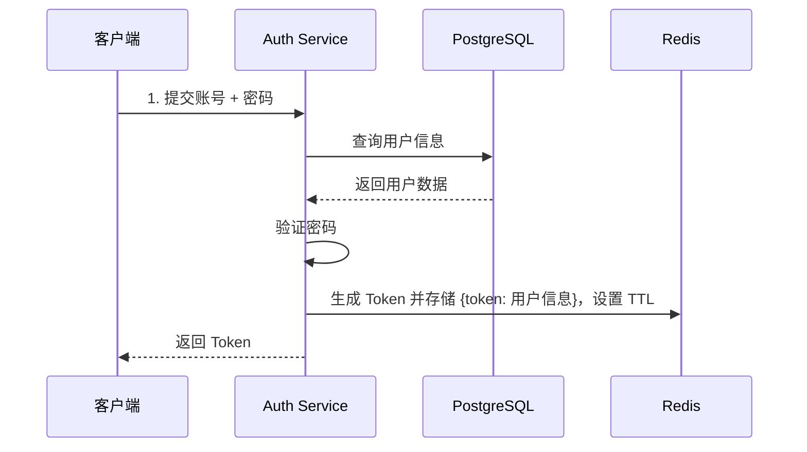
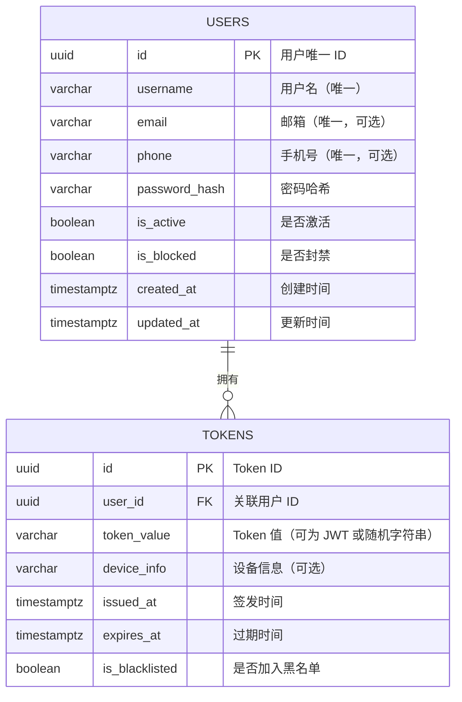

# golang-auth-service
Golang Auth Service — A unified authentication &amp; registration service built with Golang, JWT, Redis, PostgreSQL.


# Golang 统一登录注册服务（PostgreSQL + Redis）

## 1. 项目目标
- 统一用户注册、登录、登出、踢下线、黑名单管理
- 使用 **PostgreSQL** 存储用户信息
- Token 不使用纯无状态 JWT，改为 **服务端存储的 Token 会话模式**
- 支持单点登录（SSO）扩展
- 部署使用 Docker

---

## 2. 技术路线

### 架构选型
- **语言**：Golang
- **框架**：Gin / Fiber / Echo
- **数据库**：PostgreSQL（存储用户信息）
- **缓存**：Redis（验证码、Token 会话、黑名单）
- **认证方式**：Access Token 存储在 Redis（可用 JWT 或随机字符串作为 Token 值）
- **部署方式**：Docker + docker-compose

---

## 3. Token 设计方案

### 3.1 为什么不用纯 JWT
- 纯无状态 JWT 无法在服务端主动失效（不能踢下线）
- 不能轻松实现黑名单机制
- 无法在 Token 生命周期中间修改权限（除非重新发 Token）

### 3.2 新方案
1. **登录成功**
   - 生成 Access Token（UUID / JWT）
   - 将 Token 存储到 Redis（Key: `token:{token_id}`，Value: 用户信息，TTL）
   - 支持设置 **单设备登录**（登录时清除旧 Token）
2. **用户登出 / 踢下线**
   - 从 Redis 删除 Token Key
   - 将 Token 加入黑名单（可选 TTL）
3. **接口鉴权**
   - 根据 Token 去 Redis 查询用户信息
   - 如果不存在则视为无效/已失效
4. **黑名单机制**
   - Token 被列入黑名单时拒绝访问
   - 黑名单存储在 Redis，TTL 与 Token 过期时间一致

---

## 4. 组件需求

| 组件/库                 | 用途                |
| ----------------------- | ------------------- |
| `gin` / `fiber`         | HTTP API 框架       |
| `gorm` / `sqlx`         | PostgreSQL ORM/操作 |
| `uuid`                  | Token 生成          |
| `go-redis/redis/v9`     | Redis 操作          |
| `bcrypt` / `argon2`     | 密码加密            |
| `validator.v10`         | 请求参数校验        |
| Docker + docker-compose | 容器化部署          |
| Nginx（可选）           | HTTPS 反向代理      |

---

## 5. 系统架构（Mermaid）

~~~mermaid
graph TD
    subgraph Client[前端客户端<br/>(Web / Mobile / 其他服务)]
    end

    subgraph AuthService[Auth Service<br/>(Golang + Gin/Fiber)]
    end

    subgraph DB[PostgreSQL]
    end

    subgraph Cache[Redis 缓存]
    end

    Client -->|HTTP/HTTPS REST API| AuthService
    AuthService --> DB
    AuthService --> Cache
~~~


## 6. 登录 & 会话管理数据流（Mermaid）

### 登录流程



### 踢下线流程

```
mermaid


复制编辑
sequenceDiagram
    participant Admin as 管理端
    participant A as Auth Service
    participant R as Redis

    Admin->>A: 请求踢下线（指定用户或 Token）
    A->>R: 删除 Redis 中的 token key
    A->>R: 将 Token 加入黑名单（TTL 与 token 过期时间一致）
    A-->>Admin: 返回成功
```

------

## 7. 部署方案（Docker 化）

docker-compose.yml 示例：

```yaml

version: '3'
services:
  auth-service:
    build: .
    ports:
      - "8080:8080"
    depends_on:
      - postgres
      - redis
    environment:
      - DB_HOST=postgres
      - DB_USER=authuser
      - DB_PASSWORD=authpass
      - DB_NAME=authdb
      - REDIS_HOST=redis

  postgres:
    image: postgres:15
    restart: always
    environment:
      POSTGRES_USER: authuser
      POSTGRES_PASSWORD: authpass
      POSTGRES_DB: authdb
    ports:
      - "5432:5432"

  redis:
    image: redis:7
    restart: always
    ports:
      - "6379:6379"
```

------

## 8. 注意事项

1. **安全**
   - Token 存储到 Redis 时，设置合理 TTL（比如 15 分钟）
   - 采用 Refresh Token 机制进行续签
   - Redis 黑名单确保踢下线可立即生效
2. **可扩展性**
   - 预留 OAuth 2.0 / SAML 接入位置
   - 多节点部署时共享 Redis 会话数据
3. **维护**
   - 提供管理后台接口（查询在线用户、强制下线）
   - 日志记录登录、登出、踢下线等关键事件


## 9. 数据库设计（Mermaid ER 图）




## 10. Redis 存储结构

| Key 模式               | Value                          | 说明                                           |
| ---------------------- | ------------------------------ | ---------------------------------------------- |
| `token:{token_id}`     | JSON（用户ID、权限、设备信息） | 存储当前有效会话，TTL 控制过期时间             |
| `blacklist:{token_id}` | true                           | 黑名单标记，TTL 与 token 相同，用于踢下线/封禁 |


## 11. 业务规则

1. **单设备登录**
    登录时先删除该用户在 Redis 中的旧 `token:{old_token_id}`，再存新的 Token。
2. **踢下线**
    后台调用 API 删除 `token:{token_id}` 并写入 `blacklist:{token_id}`。
3. **封禁用户**
   - 将用户 `is_blocked` 标记为 true
   - 删除该用户所有 Token（遍历 Redis / Token 表）
   - 新登录直接拒绝
4. **刷新 Token**
   - Access Token TTL 较短（15~30 分钟）
   - Refresh Token TTL 较长（7~30 天）
   - 刷新时重新写入 Redis 并更新 Token 表
