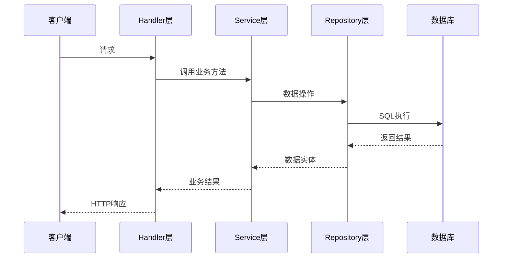

# 模块文档模板

> **使用说明**：此文档为各功能模块的文档模板，创建新模块时应基于此模板编写文档。

---

# [模块名称] 模块文档

## 📋 模块概述

简要描述模块的核心功能、目标和职责范围。

### 核心功能
- 功能点1
- 功能点2
- 功能点3

### 模块职责
- 职责1
- 职责2
- 职责3

## 🏗️ 架构设计

### 设计原则
- **单一职责**：模块只负责特定的业务领域
- **低耦合高内聚**：减少对其他模块的依赖
- **接口优先**：通过接口定义模块边界

### 组件结构
```
模块目录结构示例：
internal/[模块名]/
├── model.go          # 数据模型定义
├── repository.go     # 数据访问层
├── service.go        # 业务逻辑层
├── handler.go        # HTTP处理层
├── middleware.go     # 中间件（如需要）
└── [模块名]_test.go  # 单元测试
```

## 📊 数据模型

### 实体定义
描述模块中的核心数据实体及其关系。

#### [实体名称]
```go
type Entity struct {
    ID        uint      `gorm:"primaryKey" json:"id"`
    CreatedAt time.Time `gorm:"autoCreateTime" json:"created_at"`
    UpdatedAt time.Time `gorm:"autoUpdateTime" json:"updated_at"`

    // 业务字段
    // ...
}
```

### 字段说明
| 字段 | 类型 | 说明 | 约束 |
|------|------|------|------|
| id | uint | 主键ID | PRIMARY KEY |
| created_at | time.Time | 创建时间 | NOT NULL |
| updated_at | time.Time | 更新时间 | NOT NULL |

## 🔌 接口定义

### Repository接口
```go
type [ModuleName]Repository interface {
    Create(ctx context.Context, entity *Entity) error
    GetByID(ctx context.Context, id uint) (*Entity, error)
    Update(ctx context.Context, entity *Entity) error
    Delete(ctx context.Context, id uint) error
    List(ctx context.Context, filter *Filter) ([]*Entity, error)
}
```

### Service接口
```go
type [ModuleName]Service interface {
    // 业务方法定义
}
```

## 🚀 API接口

### REST API端点

| 方法 | 路径 | 描述 | 认证 | 请求体 | 响应体 |
|------|------|------|------|--------|--------|
| POST | `/api/v1/[模块]` | 创建资源 | 需要 | CreateRequest | CreateResponse |
| GET | `/api/v1/[模块]/{id}` | 获取资源 | 可选 | - | GetResponse |
| PUT | `/api/v1/[模块]/{id}` | 更新资源 | 需要 | UpdateRequest | UpdateResponse |
| DELETE | `/api/v1/[模块]/{id}` | 删除资源 | 需要 | - | DeleteResponse |

### 请求/响应格式

#### CreateRequest
```json
{
    "field1": "value1",
    "field2": "value2"
}
```

#### CreateResponse
```json
{
    "code": 0,
    "message": "success",
    "data": {
        "id": 1,
        "field1": "value1",
        "field2": "value2",
        "created_at": "2025-10-28T12:00:00Z"
    }
}
```

## 🔄 业务流程

### 主要业务流程

#### 流程1：[流程名称]


## ⚠️ 错误处理

### 错误码定义
| 错误码 | 错误信息 | HTTP状态码 | 说明 |
|--------|----------|------------|------|
| 40001 | 参数错误 | 400 | 请求参数不合法 |
| 40002 | 资源不存在 | 404 | 请求的资源不存在 |
| 50001 | 内部错误 | 500 | 服务器内部错误 |

### 错误响应格式
```json
{
    "code": 40001,
    "message": "参数错误：field1不能为空",
    "details": {
        "field": "field1",
        "reason": "required"
    }
}
```

## 🔒 安全考虑

### 安全措施
- **输入验证**：所有输入参数进行严格验证
- **权限控制**：基于角色的访问控制
- **数据加密**：敏感数据加密存储
- **审计日志**：记录关键操作日志

### 风险点
- 风险点1及应对措施
- 风险点2及应对措施

## 🧪 测试策略

### 测试覆盖
- **单元测试**：覆盖所有业务逻辑
- **集成测试**：测试模块间交互
- **性能测试**：验证性能指标

### 测试用例
```go
func Test[ModuleName]_Create(t *testing.T) {
    tests := []struct {
        name    string
        input   *CreateRequest
        want    *CreateResponse
        wantErr bool
    }{
        // 测试用例...
    }

    for _, tt := range tests {
        t.Run(tt.name, func(t *testing.T) {
            // 测试逻辑...
        })
    }
}
```

## 📈 性能指标

### 关键指标
- **响应时间**：P95 < 100ms
- **吞吐量**：1000 QPS
- **可用性**：99.9%
- **内存使用**：< 100MB

### 监控告警
- 响应时间超过阈值
- 错误率超过1%
- 资源使用率过高

## 📝 开发规范

### 代码规范
- 遵循Go语言官方编码规范
- 使用gofmt格式化代码
- 函数和变量使用驼峰命名
- 接口名以-er结尾

### 提交规范
- feat: 新功能
- fix: 修复bug
- docs: 文档更新
- test: 测试相关
- refactor: 重构

## 🚀 部署说明

### 环境变量
| 变量名 | 说明 | 默认值 | 必需 |
|--------|------|--------|------|
| MODULE_DATABASE_URL | 数据库连接地址 | - | 是 |
| MODULE_REDIS_URL | Redis连接地址 | - | 是 |
| MODULE_LOG_LEVEL | 日志级别 | info | 否 |

### 配置文件
```yaml
module:
  database:
    host: localhost
    port: 5432
    name: authdb
  redis:
    host: localhost
    port: 6379
  log:
    level: info
```

## 📚 相关文档

- [项目开发计划](../project/plan.md)
- [架构分析报告](../project/architecture-analysis.md)
- [变更日志](../development/changelog.md)
- [相关模块文档](./)

## 🔄 版本历史

| 版本 | 日期 | 变更内容 | 作者 |
|------|------|----------|------|
| 1.0.0 | 2025-10-28 | 初始版本 | Claude |

---

**文档维护**：随着模块的迭代更新，请及时更新本文档内容。
**最后更新**：2025-10-28