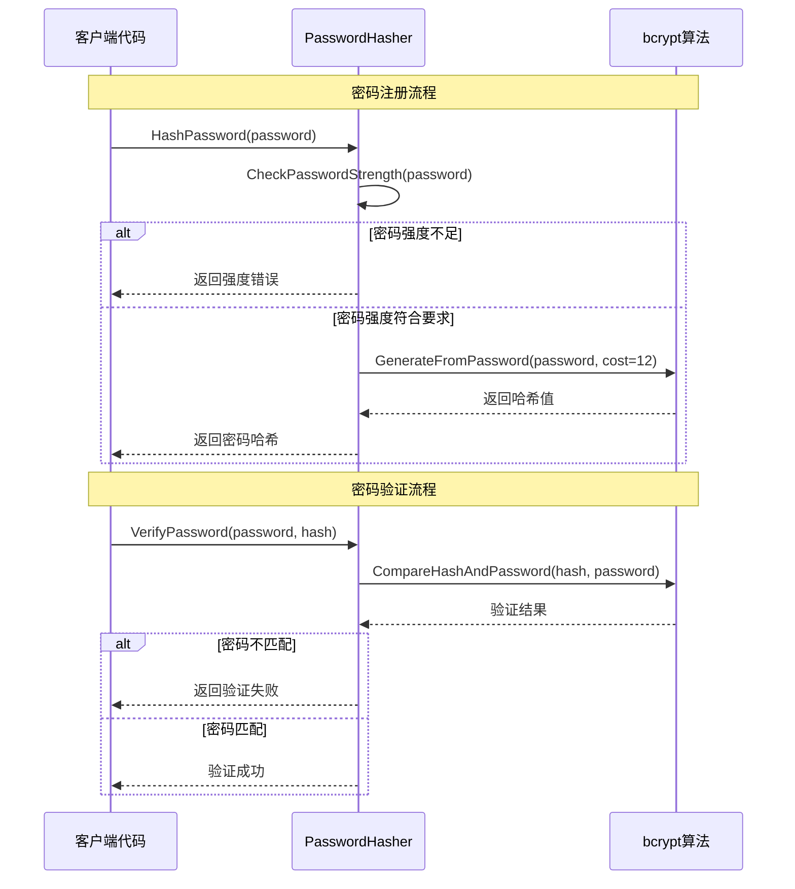

# 密码工具模块文档

## 📋 模块概述

密码工具模块负责处理用户密码的安全存储、验证强度检查和哈希生成等核心功能。该模块采用bcrypt算法进行密码加密，提供安全的密码处理服务。

### 核心功能
- 密码哈希生成和验证
- 密码强度检查
- 随机密码生成
- 密码格式验证

### 模块职责
- 确保密码存储的安全性
- 防止弱密码的使用
- 提供统一的密码处理接口
- 支持密码相关的安全策略

## 🏗️ 架构设计

### 设计原则
- **安全性优先**：采用经过验证的安全算法
- **接口抽象**：通过接口定义密码处理能力
- **可配置性**：支持安全策略的灵活配置
- **测试完备**：全面的测试覆盖确保功能正确性

### 组件结构
```
internal/utils/
├── password.go         # 密码处理核心实现
└── password_test.go    # 完整的测试套件
```

## 📊 数据模型

### 配置常量
```go
const (
    bcryptCost        = 12        // bcrypt计算复杂度
    minPasswordLength = 8         // 密码最小长度
    maxPasswordLength = 72        // 密码最大长度
)
```

### 自定义错误类型
```go
var (
    ErrPasswordTooShort      = fmt.Errorf("密码长度不能少于%d位", minPasswordLength)
    ErrPasswordTooLong      = fmt.Errorf("密码长度不能超过%d位", maxPasswordLength)
    ErrPasswordTooWeak      = fmt.Errorf("密码强度不足，必须包含大小写字母和数字")
    ErrPasswordHashFailed   = fmt.Errorf("密码哈希生成失败")
    ErrPasswordVerifyFailed = fmt.Errorf("密码验证失败")
)
```

## 🔌 接口定义

### PasswordHasher接口
```go
type PasswordHasher interface {
    HashPassword(password string) (string, error)
    VerifyPassword(password, hash string) error
    CheckPasswordStrength(password string) error
}
```

### 全局函数接口
```go
func HashPassword(password string) (string, error)
func VerifyPassword(password, hash string) error
func CheckPasswordStrength(password string) error
func IsPasswordHashValid(hash string) bool
func GenerateRandomPassword(length int) (string, error)
```

## 🚀 API接口

该模块为工具模块，不直接提供HTTP接口，而是作为其他模块的基础组件使用。

### 使用示例

#### 密码哈希生成
```go
import "github.com/your-project/internal/utils"

// 生成密码哈希
hash, err := utils.HashPassword("MySecurePassword123!")
if err != nil {
    log.Fatal("密码哈希生成失败:", err)
}
fmt.Println("密码哈希:", hash)
```

#### 密码验证
```go
// 验证密码
err := utils.VerifyPassword("MySecurePassword123!", hash)
if err != nil {
    fmt.Println("密码验证失败:", err)
} else {
    fmt.Println("密码验证成功")
}
```

#### 密码强度检查
```go
// 检查密码强度
err := utils.CheckPasswordStrength("MySecurePassword123!")
if err != nil {
    fmt.Println("密码强度不足:", err)
} else {
    fmt.Println("密码强度符合要求")
}
```

## 🔄 业务流程

### 密码处理流程



## ⚠️ 错误处理

### 错误类型说明
| 错误类型 | 错误信息 | 场景 | 处理建议 |
|----------|----------|------|----------|
| ErrPasswordTooShort | 密码长度不能少于8位 | 用户输入的密码过短 | 提示用户增加密码长度 |
| ErrPasswordTooLong | 密码长度不能超过72位 | 用户输入的密码过长 | 提示用户缩短密码长度 |
| ErrPasswordTooWeak | 密码强度不足 | 密码缺少必要的字符类型 | 提示密码强度要求 |
| ErrPasswordHashFailed | 密码哈希生成失败 | bcrypt算法执行失败 | 系统错误，记录日志 |
| ErrPasswordVerifyFailed | 密码验证失败 | 密码与哈希不匹配 | 提示用户检查密码 |

### 错误处理示例
```go
func HandleUserRegistration(password string) error {
    // 检查密码强度
    if err := utils.CheckPasswordStrength(password); err != nil {
        return fmt.Errorf("密码不符合要求: %w", err)
    }

    // 生成密码哈希
    hash, err := utils.HashPassword(password)
    if err != nil {
        log.Printf("密码哈希生成失败: %v", err)
        return fmt.Errorf("系统错误，请稍后重试")
    }

    // 保存用户信息到数据库
    return saveUser(hash)
}
```

## 🔒 安全考虑

### 安全措施
- **bcrypt算法**：使用经过验证的安全哈希算法
- **适当的cost值**：设置cost=12，在安全性和性能间取得平衡
- **自动加盐**：bcrypt内置加盐机制，防止彩虹表攻击
- **强度验证**：强制要求包含大小写字母和数字
- **长度限制**：合理的密码长度范围

### 安全特性
- **抗彩虹表**：每个密码使用不同的盐值
- **计算密集**：暴力破解需要大量计算资源
- **可配置复杂度**：可通过调整cost值适应不同安全需求
- **格式验证**：确保哈希格式的正确性

### 风险点
- **暴力破解**：通过设置高cost值降低破解速度
- **密码泄露**：哈希存储相对安全，但仍需保护数据库
- **字典攻击**：通过密码强度检查降低风险

## 🧪 测试策略

### 测试覆盖范围
- **功能测试**：所有公共方法的正常和异常情况
- **边界测试**：密码长度边界值测试
- **性能测试**：哈希生成和验证的性能基准
- **一致性测试**：多次哈希的一致性验证
- **格式测试**：哈希格式正确性验证

### 关键测试用例

#### 密码强度测试
```go
func TestPasswordStrengthValidation(t *testing.T) {
    tests := []struct {
        password    string
        expectError bool
        errorType   error
    }{
        {"ValidPass123", false, nil},
        {"short", true, ErrPasswordTooShort},
        {"weakpassword", true, ErrPasswordTooWeak},
        {"12345678", true, ErrPasswordTooWeak},
        {"ONLYUPPERCASE", true, ErrPasswordTooWeak},
    }

    for _, tt := range tests {
        t.Run(tt.password, func(t *testing.T) {
            err := CheckPasswordStrength(tt.password)
            if tt.expectError {
                assert.Error(t, err)
                assert.Contains(t, err.Error(), tt.errorType.Error())
            } else {
                assert.NoError(t, err)
            }
        })
    }
}
```

#### 性能基准测试
```go
func BenchmarkHashPassword(b *testing.B) {
    hasher := &BcryptPasswordHasher{}
    password := "BenchmarkPassword123!"

    b.ResetTimer()
    for i := 0; i < b.N; i++ {
        _, _ = hasher.HashPassword(password)
    }
}
```

## 📈 性能指标

### 关键指标
- **哈希生成时间**：P95 < 200ms (cost=12)
- **哈希验证时间**：P95 < 100ms
- **内存使用**：< 10MB
- **并发支持**：支持高并发调用

### 性能优化
- **cost值选择**：cost=12在安全性和性能间取得平衡
- **避免重复哈希**：缓存相同密码的哈希结果（需权衡安全性）
- **并发安全**：实现是线程安全的，支持并发调用

## 📝 开发规范

### 代码规范
- **接口优先**：通过接口定义能力，便于测试和扩展
- **错误处理**：提供详细的错误信息，便于问题定位
- **文档注释**：所有公共方法都有详细的注释说明
- **测试驱动**：先写测试，确保功能正确性

### 使用规范
- **统一入口**：优先使用全局函数，避免直接创建实例
- **错误检查**：必须检查所有返回的错误
- **安全考虑**：不在日志中记录明文密码
- **配置管理**：通过常量管理安全参数

## 🚀 部署说明

### 环境要求
- **Go版本**：>= 1.19
- **依赖包**：golang.org/x/crypto/bcrypt

### 配置参数
| 参数 | 说明 | 默认值 | 建议值 |
|------|------|--------|--------|
| bcryptCost | bcrypt计算复杂度 | 12 | 生产环境12-14 |
| minPasswordLength | 密码最小长度 | 8 | 8-12 |
| maxPasswordLength | 密码最大长度 | 72 | 72 |

### 安全配置建议
- **生产环境**：使用cost=12或13以提高安全性
- **开发环境**：可使用cost=10以提高开发效率
- **高安全场景**：可使用cost=14，但需权衡性能影响

## 📚 相关文档

- [项目开发计划](../project/plan.md)
- [架构分析报告](../project/architecture-analysis.md)
- [变更日志](../development/changelog.md)
- [模块文档模板](../MODULE_TEMPLATE.md)

## 🔄 版本历史

| 版本 | 日期 | 变更内容 | 作者 |
|------|------|----------|------|
| 1.0.0 | 2025-10-28 | 初始版本，实现基础密码处理功能 | Claude |

### 功能特性
- ✅ bcrypt密码哈希生成
- ✅ 密码验证功能
- ✅ 密码强度检查（无正则表达式实现）
- ✅ 随机密码生成
- ✅ 完整的测试覆盖
- ✅ 性能基准测试
- ✅ Unicode字符支持

---

**文档维护**：随着功能迭代和安全要求的提升，请及时更新本文档。
**最后更新**：2025-10-28